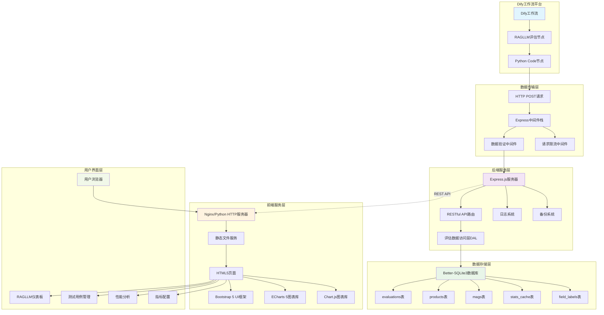
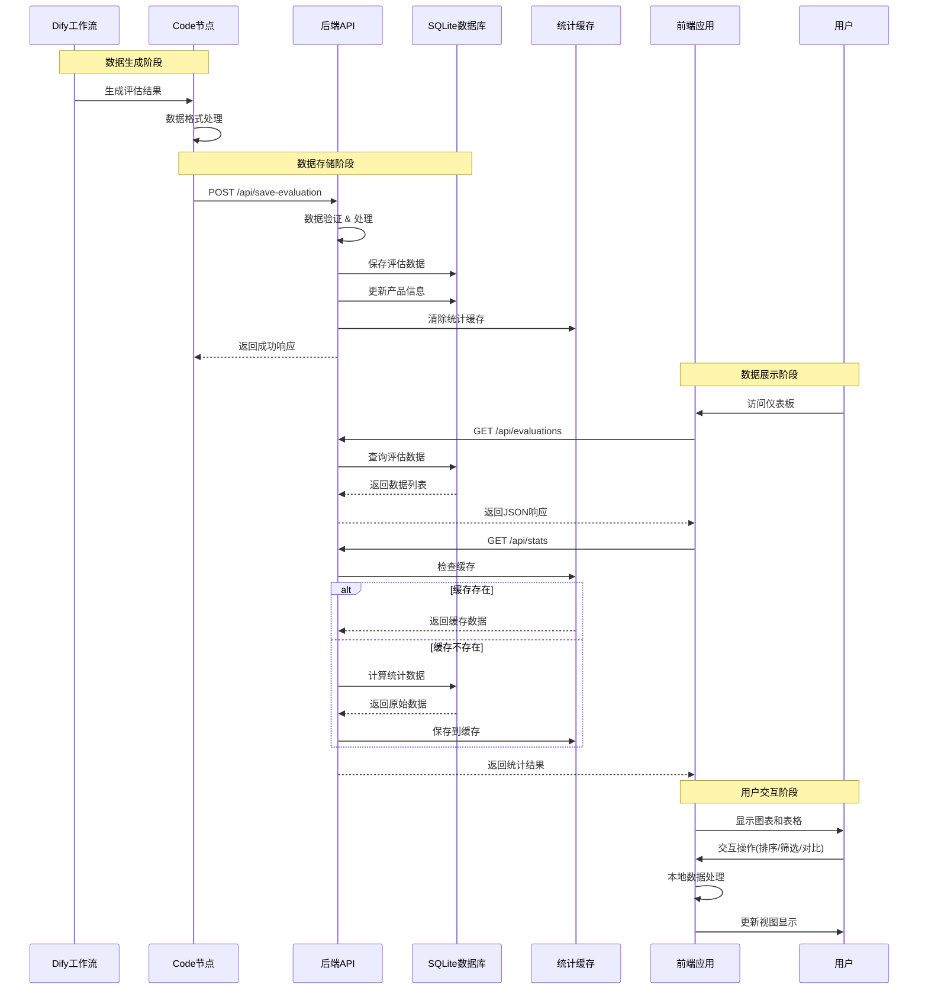
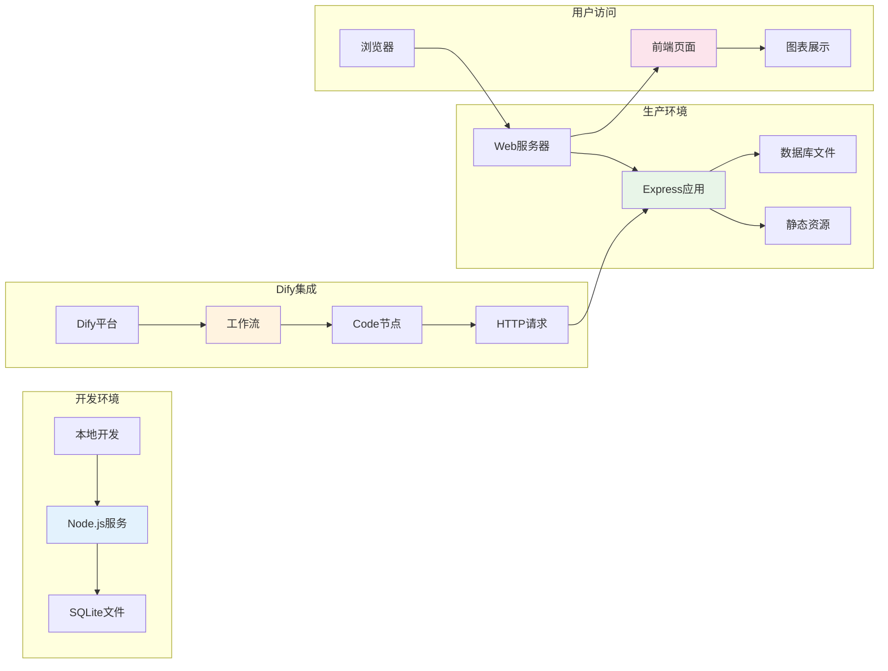
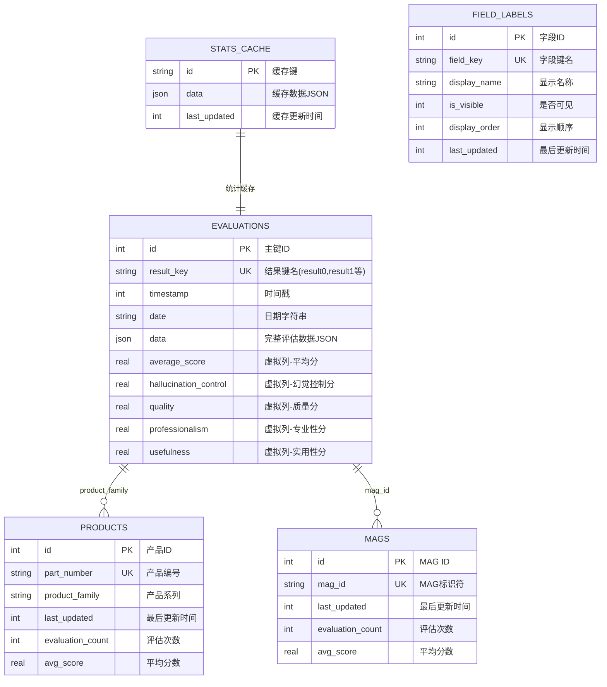

# RAGLLM评估系统可视化仪表板 - Solution Description

## 1. 项目概述 (Project Overview)

### 系统定位
- **项目名称**: RAGLLM评估系统可视化仪表板 (RAGLLM Testing System Dashboard)
- **版本**: 1.0.0
- **许可证**: MIT
- **核心价值**: 为RAGLLM(Retrieval-Augmented Generation Large Language Model)提供专业的评估结果可视化和分析平台

### 业务价值
- 🧪 **测试管理**: 完整的RAGLLM测试用例管理系统
- 📊 **多维评估**: 幻觉控制、质量、专业性、实用性四大维度评估
- 📈 **实时监控**: 实时显示评估结果统计数据和趋势分析
- 🔍 **智能分析**: 支持排序、搜索、对比和权重配置
- 📤 **数据导出**: 支持CSV格式数据导出和备份

---

## 2. 系统架构 (System Architecture)

### 整体架构图

### 真实技术栈组成
**后端技术栈**:
- **运行时**: Node.js
- **Web框架**: Express.js 4.18.2
- **数据库**: Better-SQLite3 8.5.0 (本地文件数据库)
- **中间件**: CORS 2.8.5, Body-Parser 1.20.2
- **开发工具**: Nodemon 2.0.22

**前端技术栈**:
- **标记语言**: HTML5
- **样式框架**: Bootstrap 5.3.0
- **图标库**: Font Awesome 6.4.0
- **图表库**: ECharts 5.4.3 + Chart.js
- **脚本语言**: 原生JavaScript (ES6+)

**部署技术栈**:
- **Web服务器**: Nginx (生产环境) / Python HTTP Server (开发环境)
- **进程管理**: Shell脚本 + PID文件管理
- **配置管理**: JavaScript配置文件

---

## 3. 数据流程 (Data Flow)

### 完整数据流程图

### 数据处理流程
1. **数据采集**: Dify工作流生成评估结果
2. **数据传输**: Python Code节点发送HTTP请求
3. **数据验证**: 后端中间件验证数据格式
4. **数据存储**: SQLite数据库持久化存储
5. **数据缓存**: 统计数据智能缓存机制
6. **数据展示**: 前端实时图表可视化

---

## 4. 核心功能模块 (Core Features)

### 4.1 RAGLLM测试管理模块
- **测试用例管理**: 完整的RAGLLM测试用例生命周期管理
- **评估数据存储**: 基于Better-SQLite3的高性能本地存储
- **多维度评估**: 幻觉控制、质量、专业性、实用性四大核心维度
- **数据验证**: 完整的Dify工作流数据格式验证机制
- **批量处理**: 支持arg1嵌套格式的批量评估结果处理

### 4.2 可视化仪表板模块
- **RAGLLM仪表板**: 实时统计数据概览和KPI监控
- **多图表支持**: ECharts 5 + Chart.js双图表引擎
- **雷达图分析**: 四维度评估结果雷达图对比
- **趋势分析**: 时间序列数据分析和性能趋势
- **分布图表**: 评估维度分数分布和相关性分析

### 4.3 测试用例分析模块
- **智能搜索**: 全文搜索和多字段过滤功能
- **动态排序**: 支持timestamp、average_score等多字段排序
- **测试对比**: 多个测试用例横向对比分析
- **权重配置**: 自定义四大评估维度权重
- **数据导出**: CSV格式测试数据导出

### 4.4 系统运维模块
- **多环境部署**: Nginx生产环境 + Python开发环境
- **进程管理**: Shell脚本 + PID文件的进程生命周期管理
- **日志系统**: 结构化日志记录和错误追踪
- **缓存优化**: SQLite统计数据智能缓存机制
- **配置管理**: 基于JavaScript的灵活配置系统

---

## 5. 技术特性 (Technical Features)

### 5.1 数据库性能优化
- **Better-SQLite3**: 高性能同步SQLite数据库引擎
- **JSON1扩展**: 原生JSON数据类型支持和虚拟列索引
- **智能缓存**: stats_cache表预计算统计数据，减少重复查询
- **事务处理**: 数据库事务保证RAGLLM评估数据一致性
- **分页查询**: 支持大量测试用例的高效分页加载

### 5.2 前端用户体验
- **响应式设计**: Bootstrap 5框架适配各种屏幕尺寸
- **双图表引擎**: ECharts 5 + Chart.js提供丰富的可视化选择
- **实时更新**: 基于Fetch API的异步数据更新
- **缓存控制**: HTTP缓存控制头防止数据过期
- **加载优化**: 渐进式页面加载和图表懒加载

### 5.3 系统可靠性与安全
- **中间件栈**: 数据验证、请求限流、CORS跨域保护
- **错误处理**: 完善的异常捕获和错误日志记录
- **进程管理**: PID文件管理和优雅关闭机制
- **数据备份**: 自动SQLite数据库备份和恢复
- **配置安全**: 环境变量和配置文件分离管理

---

## 6. 部署架构 (Deployment Architecture)

### 部署组件图

### 部署特点
- **轻量级部署**: 单机部署，资源占用少
- **快速启动**: 一键启动脚本，部署简单
- **跨平台支持**: Windows/Linux/macOS全平台支持
- **配置灵活**: 环境变量配置，适应不同环境

---

## 7. 数据模型 (Data Model)

### Better-SQLite3数据库表结构

### 数据存储特点
- **JSON1扩展**: SQLite原生JSON数据类型，支持JSON路径查询
- **虚拟列索引**: 从JSON数据中提取评估维度创建虚拟列和索引
- **智能缓存**: stats_cache表存储预计算的统计数据
- **关系维护**: 产品和MAG信息自动维护和更新
- **事务安全**: 使用SQLite事务保证数据一致性

---

## 8. API接口设计 (API Design)

### RESTful API架构

| 端点 | 方法 | 功能 | 参数 |
|------|------|------|------|
| `/api/evaluations` | GET | 获取评估列表 | page, limit, sortBy, sortOrder |
| `/api/evaluations/:id` | GET | 获取单个评估详情 | id |
| `/api/save-evaluation` | POST | 保存评估数据 | 评估数据JSON |
| `/api/stats` | GET | 获取统计概览 | - |
| `/api/stats/overview` | GET | 获取详细统计 | - |
| `/api/test-cases` | GET | 获取测试用例 | page, limit |

### API特性
- **统一响应格式**: 标准化JSON响应结构
- **错误处理**: 完善的HTTP状态码和错误信息
- **参数验证**: 请求参数自动验证
- **限流保护**: API请求频率限制

---

## 9. 监控与运维 (Monitoring & Operations)

### 系统监控指标
- **性能指标**: 响应时间、吞吐量、错误率
- **资源指标**: CPU使用率、内存占用、磁盘空间
- **业务指标**: 评估数据量、用户访问量、功能使用率

### 运维特性
- **日志管理**: 结构化日志记录和分析
- **健康检查**: 系统组件健康状态监控
- **自动备份**: 定时数据备份机制
- **故障恢复**: 快速故障定位和恢复

---

## 10. 未来规划 (Future Roadmap)

### 短期目标 (3-6个月)
- **RAGLLM模型扩展**: 支持更多RAGLLM模型评估
- **高级分析功能**: 评估结果相关性分析和异常检测
- **用户权限管理**: 多用户角色和权限控制系统
- **移动端优化**: 响应式设计优化和PWA支持

### 中期目标 (6-12个月)
- **AI智能分析**: 基于历史数据的RAGLLM性能预测
- **多数据源集成**: 支持更多AI评估平台和工具链
- **实时流处理**: 支持实时评估数据流处理和告警
- **高级可视化**: 3D图表和交互式数据探索

### 长期目标 (1-2年)
- **分布式架构**: 支持大规模RAGLLM评估集群
- **云原生部署**: Kubernetes容器化部署和自动扩缩容
- **开放API生态**: 构建RAGLLM评估标准化API生态
- **智能优化建议**: 基于评估结果的RAGLLM模型优化建议

---

## 总结 (Summary)

RAGLLM评估系统可视化仪表板是一个**专业化、高性能、易扩展**的RAGLLM评估数据可视化解决方案。基于Better-SQLite3高性能数据库和现代化前端技术栈，通过与Dify工作流的深度集成，实现了从RAGLLM评估到可视化分析的完整闭环，为AI研究人员和工程师提供了强大的RAGLLM性能分析和优化工具。

### 核心优势
- ✅ **专业定位**: 专门针对RAGLLM评估场景设计
- ✅ **技术先进**: Better-SQLite3 + 双图表引擎，性能卓越
- ✅ **集成深度**: 与Dify平台深度集成，支持复杂数据格式
- ✅ **功能完整**: 涵盖测试管理、数据分析、可视化展示全流程
- ✅ **部署灵活**: 支持Nginx生产环境和Python开发环境
- ✅ **扩展性强**: 模块化架构，易于功能扩展和定制
