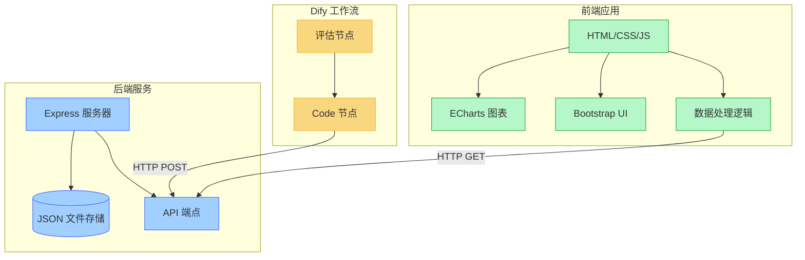
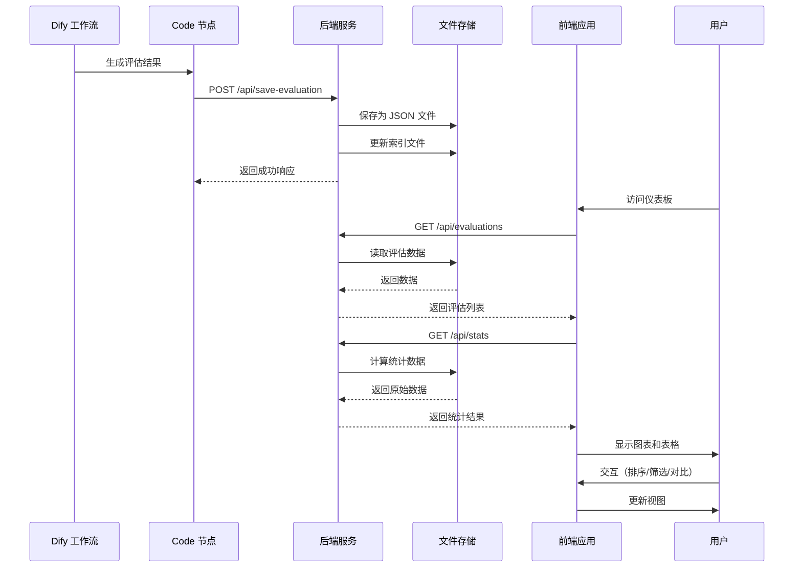
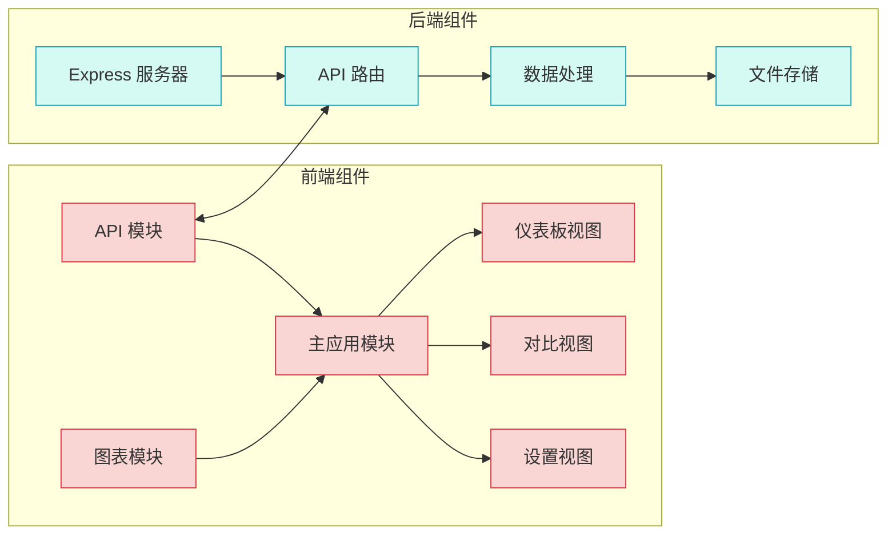

# Dify 评估结果可视化仪表板


这是一个用于可视化 Dify 工作流评估结果的框架，包括后端 API 和现代化前端实现。该框架允许你将 Dify 工作流中的评估结果保存并可视化，支持多种图表、排序、搜索和对比功能。

## 技术栈

基于 HTML5、CSS3、JavaScript 和 ECharts 5 构建的实现，提供丰富的视觉效果和交互体验。

## 系统设计

### 系统架构图



### 数据流程图



### 组件交互图



## 功能特点

- 📊 实时显示评估结果统计数据
- 📈 多种图表展示评估维度分布
- 🔍 可排序和搜索的评估结果表格
- 📋 详细的评估结果查看
- 🔄 多结果对比功能
- 📉 时间趋势分析
- ⚖️ 维度权重配置
- 📤 数据导出功能
- 📱 响应式设计 - 适配各种屏幕尺寸
- 🎨 图表效果 - 雷达图、柱状图、渐变填充
- 💎 精美 UI 组件 - 使用 Bootstrap 5 构建的界面

## 文件结构说明

项目文件结构分为以下几个部分：

### 核心文件

这些文件是项目的核心组件，对于系统功能至关重要：

- **后端核心文件**：
  - `backend/server.js` - 主服务器文件，处理API请求和数据存储
  - `backend/config.example.js` - 配置模板，用于创建实际配置文件
  - `backend/middleware/validation.js` - 请求验证中间件
  - `backend/middleware/rate-limiter.js` - 请求限流中间件
  - `backend/utils/logger.js` - 日志工具
  - `backend/utils/backup.js` - 数据备份工具
  - `backend/dify_code.py` - Dify工作流集成代码

- **前端核心文件**：
  - `frontend-html/index.html` - 主页面
  - `frontend-html/css/styles.css` - 样式表
  - `frontend-html/js/api.js` - API交互
  - `frontend-html/js/charts.js` - 图表处理
  - `frontend-html/js/main.js` - 主逻辑

### 部署工具

这些文件用于部署和管理系统，但不直接参与系统功能：

- **主要部署脚本**：
  - `deploy.sh` - 主部署脚本入口点
  - `stop.sh` - 停止服务脚本入口点
  - `scripts/deploy/deploy.sh` - 完整部署脚本
  - `scripts/deploy/stop.sh` - 完整停止脚本

- **前端部署脚本**：
  - `scripts/deploy/frontend-deploy.sh` - 前端独立部署脚本
  - `scripts/deploy/frontend-nginx-deploy.sh` - Nginx前端部署脚本
  - `scripts/deploy/frontend-nginx-stop.sh` - Nginx前端停止脚本

- **Nginx配置文件**：
  - `frontend-html/nginx.conf` - Nginx配置
  - `frontend-html/nginx-include.conf` - Nginx包含配置
  - `frontend-html/nginx-standalone.conf` - Nginx独立配置

### 辅助工具

这些文件提供额外的功能和支持：

- `scripts/setup.js` - 项目设置脚本
- `scripts/deploy/upgrade-node.sh` - Node.js升级脚本
- `package.json` - 项目依赖和脚本
- `README.md` - 项目文档

## 部署步骤

### 前提条件

- Node.js 14+ (推荐 16+)
  - 如果您的 Node.js 版本过低，可以使用项目中的 `scripts/deploy/upgrade-node.sh` 脚本进行升级
  - 运行方式: `chmod +x scripts/deploy/upgrade-node.sh && ./scripts/deploy/upgrade-node.sh`
- 运行中的 Dify 工作流

### 步骤 1：克隆或下载代码

确保你已经下载了完整的代码库，包含以下目录结构：

```
DIFY_UI/
├── backend/                # 后端服务
│   ├── data/               # 存储评估数据的文件夹
│   ├── middleware/         # 中间件
│   │   ├── validation.js   # 请求验证中间件
│   │   └── rate-limiter.js # 请求限流中间件
│   ├── utils/              # 工具
│   │   ├── logger.js       # 日志工具
│   │   └── backup.js       # 备份工具
│   ├── dify_code.py        # Dify Code 节点脚本
│   ├── server.js           # Express 服务器
│   ├── config.example.js   # 配置模板
│   └── package.json        # 后端依赖
├── frontend-html/          # HTML5 前端
│   ├── css/                # 样式文件
│   │   └── styles.css      # 主样式表
│   ├── js/                 # JavaScript 文件
│   │   ├── api.js          # API 交互
│   │   ├── charts.js       # 图表处理
│   │   └── main.js         # 主逻辑
│   ├── index.html          # 主页面
│   ├── nginx.conf          # Nginx配置
│   ├── nginx-include.conf  # Nginx包含配置
│   └── nginx-standalone.conf # Nginx独立配置
├── scripts/                # 脚本目录
│   ├── deploy/             # 部署脚本目录
│   │   ├── deploy.sh       # 完整部署脚本
│   │   ├── stop.sh         # 停止服务脚本
│   │   ├── frontend-deploy.sh # 前端独立部署脚本
│   │   ├── frontend-nginx-deploy.sh # Nginx前端部署脚本
│   │   ├── frontend-nginx-stop.sh # Nginx前端停止脚本
│   │   └── upgrade-node.sh # Node.js 升级脚本
│   └── setup.js            # 设置脚本
├── deploy.sh               # 部署脚本入口点
├── stop.sh                 # 停止服务脚本入口点
├── package.json            # 根目录依赖和脚本
└── README.md               # 项目说明
```

### 步骤 2：安装依赖

**方法 1：使用根目录 package.json（推荐）**

打开命令行终端，在项目根目录中运行：

```bash
# 安装根目录依赖
npm install

# 安装所有子项目依赖
npm run install:all

# 运行设置脚本（配置身份验证等）
npm run setup
```

**方法 2：手动安装各个部分**

或者，您可以分别安装后端和前端依赖：

```bash
# 安装后端依赖
cd DIFY_UI/backend
npm install
cd ..

# 前端使用 HTML5，无需安装依赖
```

这将安装 Express、CORS 和其他必要的依赖项。

### 步骤 3：启动后端服务

在后端目录中，启动 Express 服务器：

```bash
node server.js
```

你应该会看到以下输出：

```
服务器运行在 http://10.193.21.115:3000
```

### 步骤 4：在 Dify 工作流中集成

1. 登录到你的 Dify 账户
2. 打开包含评估结果的工作流
3. 在最后一个输出评估结果的节点后添加一个 Code 节点
4. 将 `backend/dify_code.py` 中的代码复制到 Code 节点中
5. 配置 Code 节点的输入参数，确保它接收前一个节点的评估结果输出
6. 保存工作流

### 步骤 5：测试集成

1. 运行 Dify 工作流，生成一些评估结果
2. 检查后端服务器的控制台输出，确认数据已成功接收
3. 检查 `backend/data` 目录，确认评估数据文件已创建

### 步骤 6：部署前端

```bash
cd DIFY_UI/frontend-html
chmod +x deploy.sh
./deploy.sh  # HTML5 前端不需要安装依赖
```

部署完成后，您可以在局域网中的浏览器访问 http://10.193.21.115:3001 使用可视化仪表板。

### 注意：身份验证已被移除

由于在 Node.js v22+ 中存在兼容性问题，身份验证功能已被移除。如果您需要保护您的仪表板，请考虑以下替代方案：

1. 使用网络级别的安全措施（如防火墙规则）
2. 设置反向代理（如 Nginx）并在其中配置身份验证
3. 将应用部署在受限的内部网络中

如果您使用的是较旧版本的 Node.js（v18 或 v20），您可以考虑回滚到之前的版本，其中包含身份验证功能。

### 步骤 8：一键部署（后端+前端）

如果您想一次性部署后端和前端，可以使用根目录下的部署脚本：

```bash
cd DIFY_UI
chmod +x deploy.sh
./deploy.sh --install  # 首次运行时安装依赖
```

部署完成后，您可以在局域网中的浏览器访问 http://10.193.21.115:3001 使用可视化仪表板。

**注意**：所有部署脚本已经重组到 `scripts/deploy` 目录中，但为了保持兼容性，根目录下的 `deploy.sh` 和 `stop.sh` 仍然可以作为入口点使用。如果您想直接使用重组后的脚本，可以这样做：

```bash
cd DIFY_UI
chmod +x scripts/deploy/deploy.sh
./scripts/deploy/deploy.sh --install  # 首次运行时安装依赖
```

同样，停止服务也可以使用：

```bash
cd DIFY_UI
chmod +x scripts/deploy/stop.sh
./scripts/deploy/stop.sh
```

## 使用指南

### 查看统计数据

仪表板顶部显示评估总数、总平均分和最高评分维度等统计数据，提供精美的卡片设计和微型趋势图。

### 查看图表

- **评分维度分布**：雷达图展示各维度的平均分布，提供 3D 效果和渐变填充
- **评分维度对比**：柱状图对比各维度的平均分，提供动画效果和丰富的颜色
- **评分随时间变化趋势**：折线图展示评分随时间的变化，提供平滑曲线和区域填充

### 查看评估结果列表

表格展示所有评估结果，支持：
- 按任意列排序（点击列标题或使用排序下拉菜单）
- 搜索过滤（使用搜索框）
- 查看详情（点击"详情"按钮）
- 添加到对比（点击"对比"按钮）

### 配置维度权重

1. 点击导航栏中的天平图标
2. 调整各维度的权重滑块
3. 点击"应用"按钮保存设置
4. 查看加权平均分列，了解权重调整后的结果

### 对比评估结果

1. 在表格中点击"对比"按钮，将评估结果添加到对比列表
2. 点击导航栏中的"对比"按钮，查看所选评估结果的对比视图
3. 在对比视图中，可以看到雷达图和表格形式的对比

### 导出数据

点击表格上方的"导出 CSV"按钮，可以将当前筛选的评估结果导出为 CSV 文件。


## 故障排除

### Node.js 版本过低

如果您在启动前端时遇到类似以下错误：

```
SyntaxError: Unexpected reserved word
    at Loader.moduleStrategy (internal/modules/esm/translators.js:133:18)
```

这表明您的 Node.js 版本太旧，不支持 ESM (ECMAScript Modules)。解决方法：

1. 使用项目根目录中的升级脚本：`chmod +x upgrade-node.sh && ./upgrade-node.sh`
2. 升级完成后，重新安装依赖并部署：`./deploy.sh --install`

### 无法连接到服务器

- 确保后端服务器正在运行
- 检查端口 3000 是否被其他应用占用
- 确保服务器 IP 地址配置正确

### 无法显示数据

- 检查 Dify Code 节点是否正确配置
- 检查网络连接是否正常
- 查看后端服务器的控制台输出，检查是否有错误

### 图表不显示

- 检查浏览器控制台是否有错误信息
- 确保你的浏览器支持 ECharts 5
- 确保 Bootstrap 和 ECharts 正确加载

## 维护与更新

### 数据备份

评估数据存储在 `backend/data` 目录中，建议定期备份该目录。

### 清理旧数据

如果数据量变得很大，可以手动删除 `backend/data` 目录中的旧文件，但请确保保留 `index.json` 文件或在删除后重新创建它。

### 更新框架

1. 拉取最新代码
   ```bash
   git pull
   ```

2. 使用根目录 package.json（推荐）
   ```bash
   npm install  # 更新根目录依赖
   npm run install:all  # 更新所有子项目依赖
   ```

3. 或者手动更新各部分
   ```bash
   # 更新后端
   cd backend
   npm install  # 如有新依赖
   cd ..

   # 更新前端
   cd frontend-html
   # HTML5 前端不需要安装依赖
   cd ..
   ```

4. 启动服务
   ```bash
   # 使用根目录脚本启动所有服务
   ./deploy.sh
   # 或
   ./scripts/deploy/deploy.sh

   # 或者分别启动
   cd backend
   node server.js
   cd ..

   cd frontend-html
   python -m http.server 3001  # Python 3
   # 或
   python -m SimpleHTTPServer 3001  # Python 2
   cd ..
   ```

### 文件结构维护

如果您对项目进行了修改或扩展，请确保更新以下内容：

1. 保持脚本目录结构一致
   - 所有部署相关脚本应放在 `scripts/deploy` 目录中
   - 根目录的 `deploy.sh` 和 `stop.sh` 仅作为入口点

2. 更新配置文件
   - 如果添加了新的配置选项，请同时更新 `backend/config.example.js`
   - 确保新用户可以通过复制示例配置文件来快速设置系统

3. 文档更新
   - 如果添加了新功能或更改了现有功能，请更新 README.md
   - 保持文件结构说明部分的准确性


## 技术栈详情

### 后端
- **Node.js** - JavaScript 运行时
- **Express** - Web 应用框架
- **文件系统存储** - 使用 JSON 文件存储评估数据

### 前端
- **HTML5** - 标准标记语言
- **CSS3** - 样式表语言
- **JavaScript** - 脚本语言
- **Bootstrap 5** - 响应式 CSS 框架
- **ECharts 5** - 强大的数据可视化库

## 贡献指南

欢迎贡献代码、报告问题或提出新功能建议。请遵循以下步骤:

1. Fork 仓库
2. 创建功能分支 (`git checkout -b feature/amazing-feature`)
3. 提交更改 (`git commit -m 'Add some amazing feature'`)
4. 推送到分支 (`git push origin feature/amazing-feature`)
5. 创建 Pull Request

## 许可证

本项目采用 MIT 许可证。
